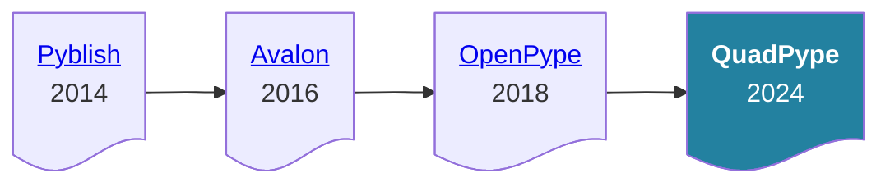

# Welcome

**QuadPype** is an open source comprehensive solution designed to streamline and structure studio workflows for all kind of productions (2D, 3D, VFX, …). Whether you're an artist, developer, or project manager, **QuadPype** provides the tools you need to simplify and enhance digital content creation.

---

## 🌟 **Key Features**

- **Centralized Project Management**: **QuadPype** is linked to your production tracker to optimise the project management and centralized the information.
- **Integration with Softwares**: Compatible with major digital content creation tools (DCC), [see integrations](#-integrations).
- **Remote Access Capabilities**: Enables collaboration from the studio, from home and ease the way to collaborate with other entities around the world.
- **Modular Design with Extensions**: Customize QuadPype by adding modules for additional functionality tailored to your needs.
- **Active Development**: The solution is actively maintained by the Quad's [Developer Team](https://github.com/quadproduction/quadpype/wiki/08-%E2%80%90-Maintainers).

## 🧩 **Integrations**

QuadPype adapts to different organizational setups and is integrated in the following products:

## 🚀 **Getting Started**

***You are a …*** 

| <h3>👥 User</h3> | <h3>👩‍💼 Studio Admin</h3> | <h3>🧑‍💻 Developer / TD</h3> |
| :--: | :-----------: | :------------: |
|  |  |  |

## 📜 **History**

**QuadPype** is the updated and maintained successor of [**OpenPype**](https://github.com/ynput/OpenPype). The core maintainers of **OpenPype** have decided to create a new product called **AYON**, but this solution seems to us over-complexify the goal of a simple to install, setup, configure and use pipeline solution. This is why we decided to create this repository.

But **OpenPype** isn't the starting point of this pipeline solution, a lot of people have worked on multiple open source projects to get to the point we are today.

These are the projects that leads us to create **QuadPype**:

## 🏗️ Contributing

As you can see by the diagram above, **QuadPype** is the result of the collaborative effort of dozens of people with the common goal to create a good pipeline solution. In keeping with this spirit, all contributions are encouraged, either by reporting [Issues](https://github.com/quadproduction/quadpype/issues) or creating [Pull Requests](https://github.com/quadproduction/quadpype/pulls) to improve the solution.

> [!NOTE]
> If you have development skills or want to try debugging **QuadPype** by yourself, check the [Developer Documentation](https://github.com/quadproduction/quadpype/wiki/07-%E2%80%90-Development).

## 📑 License

The project is under the [MIT License](https://github.com/quadproduction/quadpype/blob/main/LICENSE).
